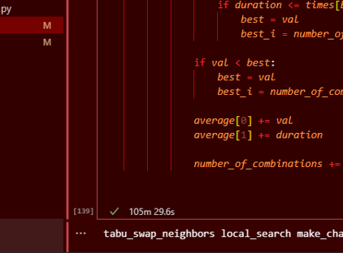
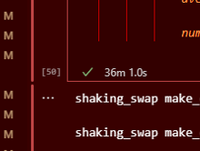
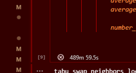

# minimum_linear_arrangement_method_suite
A suite of algorithms and methods adapted to deal with the well known NP-hard problem of Minimum Linear Arrangement.

This project is meant to showcase and compare the usefulness of different metaheuristics against the MinLA problem.

### Methods used:
1. Genetic Algorithms
2. Local Search
3. Simulated Annealing
4. Variable Neighborhood Search
5. Tabu Search
6. Tabu combined with other S-Metaheuristics

Many subparts of these methods (*change functions, shake functions, crossovers, selections, mutations, neigborhood generators*) were created and almost all possible combinations of these were tested on provided datasets.

That being said, if you decide to run any of the *.ipynb* files by selecting the option to *Run All Cells*, be advised that for larger graph dimensions the execution time can be very long. MinLA is an NP-hard problem after all, and none of these methods resulted in a breakthrough or evolution of how we approach it.
Most files test all combinations of a method using loops.

So to avoid cell execution times looking like this:

you could run the isolated combo you want to test.

Documentations is provided in the *documentation* directory, alongside all of the literature used for aid or examples.

